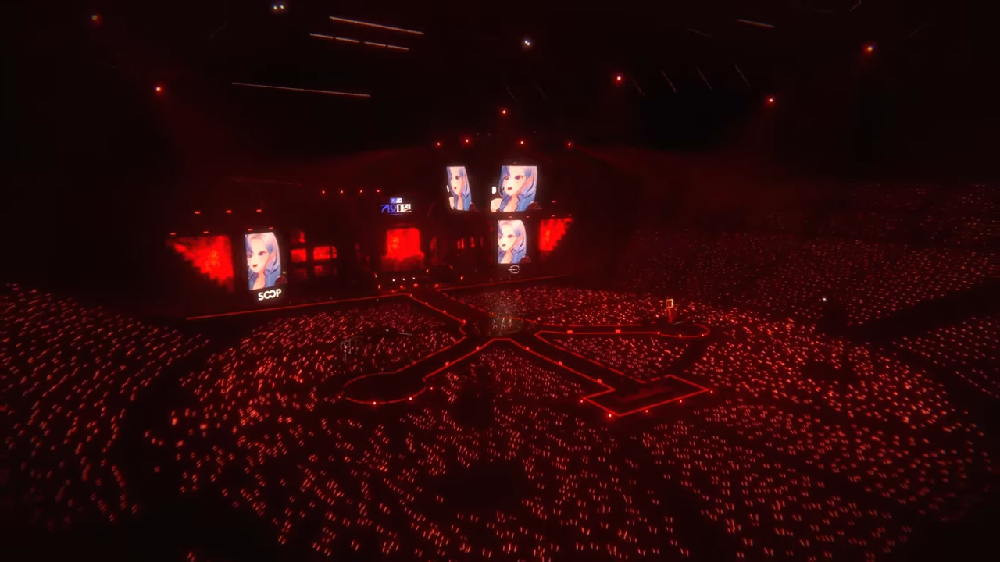
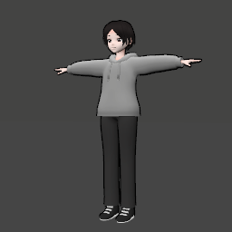
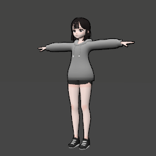
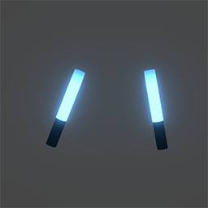
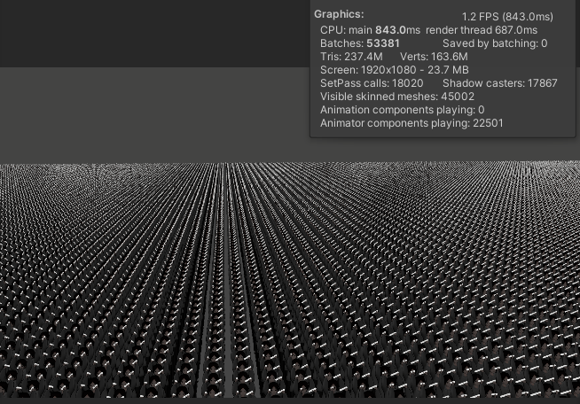
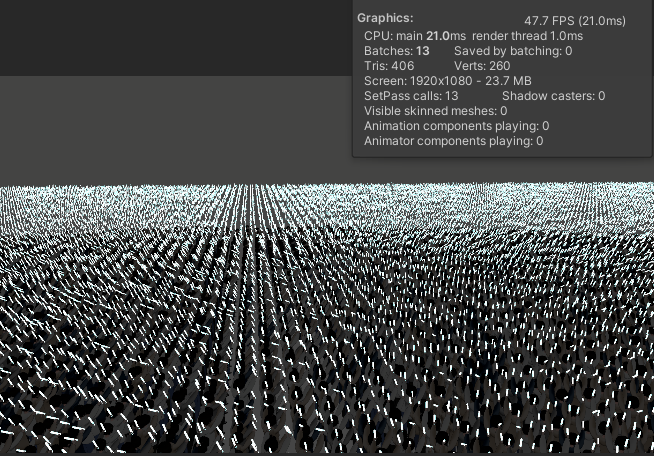
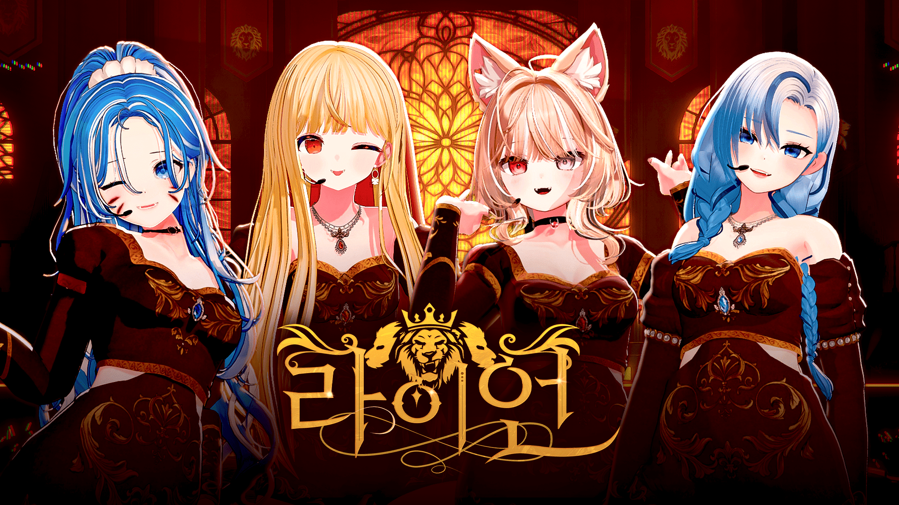
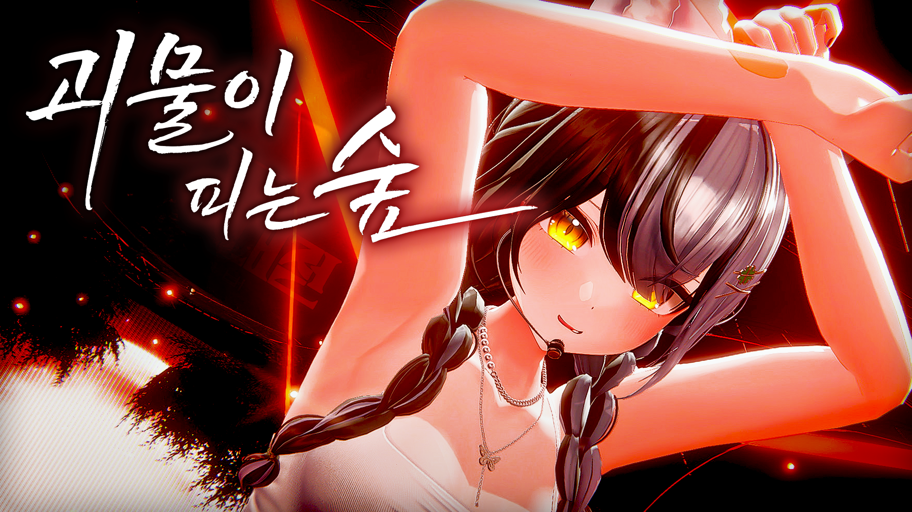
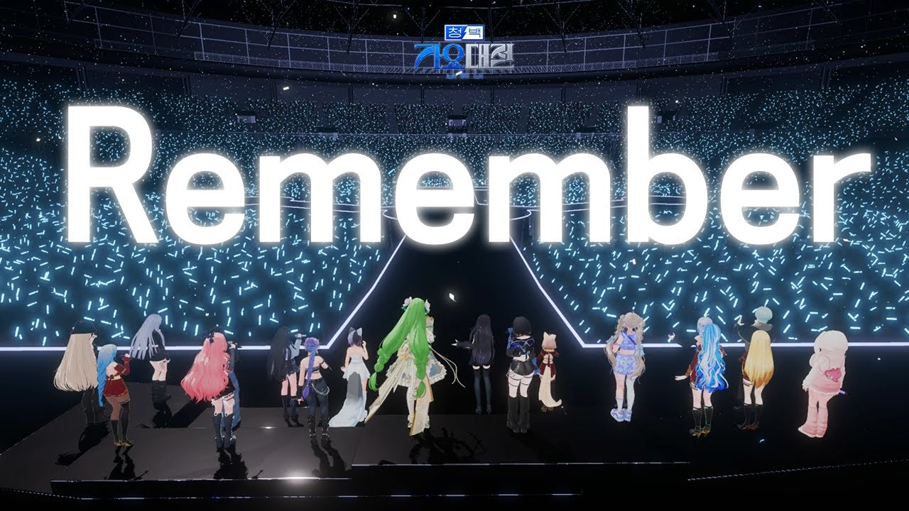
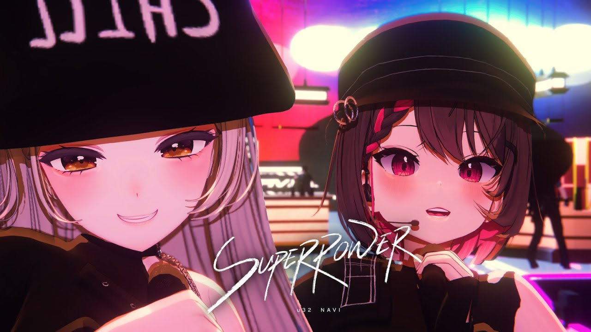

# Unity_Fanlight

#### 관객석에서 응원봉을 흔드는 연출을 위한 시스템
#### 메시 렌더링 및 애니메이션을 GPU 코딩으로 최적화

 

## 기능
|내용|세부내용|
|---|---|
|GPU Instancing|드로우콜 최적화|
|Compute Shader|Target LookAt, 컬링 및 LOD|
|Vertex Shader|관객 애니메이션|
|Scriptable Object|인스턴스 패키징|
|Timeline Scripting|Fanlight 시스템 제어|
|Support Cinemachine|VirtualCamera 대응|

 

## 인스턴스 생성
|Default|Brush Painting|
|:---:|:---:|
|||
|Grid 기반 범위 설정|브러쉬 페인팅 추가/제거|

 

## 인스턴스 정보
### 메시 타입
|Human/Man|Human/Girl|Stick/Cylinder(변경예정)|Stick/Circle(추가예정)|
|:---:|:---:|:---:|:---:|
|||||
|남자|여자|원기둥 응원봉|구형 응원봉|
### 애니메이션 타입
|RockOne|RockBoth|WaveOne|ShakeBoth|
|:---:|:---:|:---:|:---:|
|||||
|한팔 흔들기|양팔 흔들기|한팔 웨이브|환호|

 

## 타임라인 컨트롤

Fanlight Control을 담당하는 커스텀 트랙 및 클립

타임라인 프레임 연동과 사용자가 직접 BPM을 설정해서 노래 정박에 하이라이트 들어가게끔

클립 별 애니메이션, 응원봉 색 & 강도, 플리커링 이벤트 및 클립 간 모든 요소 블렌딩 기능

추후 개발 : 관객과 응원봉 클립 분리

 

## 스트레스 테스트
테스트 환경
- PC : 5950X / RTX 3080 / RAM 32GB
- 인스턴스 수 : 22,500
- 메시 폴리 카운트 : 157,680,000
- 메시 버텍스 카운트 : 154,575,000

|Prefab + Animator|Fanlight System|
|:---:|:---:|
|||
|프레임 1.2|프레임 47.7|
|배치카운트 53381|배치카운트 13|
|패스콜 18020|패스콜 13|

 

## 사용 사례
#### <a href="https://youtu.be/Ef-MRWAuxl4?si=bBGenQ0w0svksLmz" target="_blank">(여자)아이들((G)I-DLE) - LION Covered by 고여름 이주인 쿠우 한세긴 | 청백가요대전

---
#### <a href="https://youtu.be/7xNsG3OMwiY?si=k39dgHVmXUNLP_K8" target="_blank">[청백가요대전] Miiro-「괴물이 피는 숲」 Cover by.비몽 feat.핑맨

---
#### <a href="https://youtu.be/i3ftfMXvquk?si=yS7oZUIkEGxMgng4" target="_blank">REMEMBER - 버튜버 청백가요대전 20명 단체곡

---
#### <a href="https://youtu.be/Xdd3J8EFy6I?si=B5_PMD4owXeZkGRm" target="_blank">[청백가요대전] SUPERPOWER - 나비&u32 (Cover) 4K

---
