# Unity_Fanlight

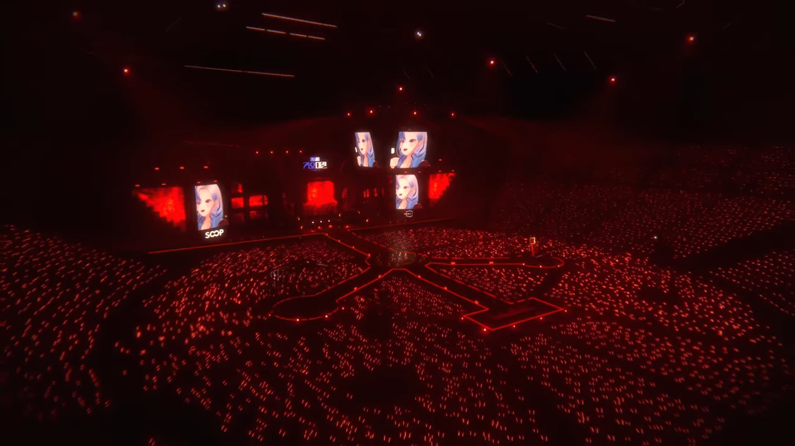

#### 관객석에서 응원봉을 흔드는 연출을 위한 시스템
#### 메시 렌더링 및 애니메이션을 GPU 코딩으로 최적화

 

## 기능
|내용|세부내용|
|---|---|
|GPU Instancing|드로우콜 최적화|
|Compute Shader|Target LookAt, 컬링 및 LOD|
|Vertex Shader|관객 애니메이션|
|Scriptable Object|인스턴스 패키징|
|Timeline Scripting|Fanlight 시스템 제어|
|Support Cinemachine|VirtualCamera 대응|

 

## 인스턴스 생성
|Default|Brush Painting|
|:---:|:---:|
|||
|Grid 기반 범위 설정|브러쉬 페인팅 추가/제거|

 

## 인스턴스 정보
### 메시 타입
|Human/Man|Human/Girl|Stick/Cylinder|Stick/Circle(추가예정)|
|:---:|:---:|:---:|:---:|
|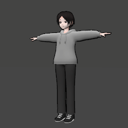|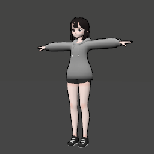|||
|남자|여자|원기둥 응원봉|구형 응원봉|
### 애니메이션 타입
|RockOne|RockBoth|WaveOne|ShakeBoth|
|:---:|:---:|:---:|:---:|
|||||
|한팔 흔들기|양팔 흔들기|한팔 웨이브|환호|

 

## 타임라인 컨트롤

Fanlight Control을 담당하는 커스텀 트랙 및 클립

타임라인 프레임 연동과 사용자가 직접 BPM을 설정해서 노래 정박에 하이라이트 들어가게끔

클립 별 애니메이션, 응원봉 색 & 강도, 플리커링 이벤트 및 클립 간 모든 요소 블렌딩 기능

 

## 스트레스 테스트
테스트 환경
- PC : 5950X / RTX 3080 / RAM 32GB
- 인스턴스 수 : 22,500
- 메시 폴리 카운트 : 157,680,000
- 메시 버텍스 카운트 : 154,575,000

|Prefab + Animator|Fanlight System|
|:---:|:---:|
|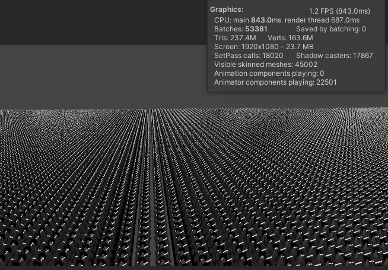|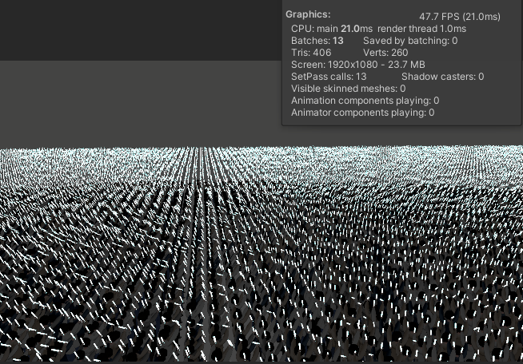|
|프레임 1.2|프레임 47.7|
|배치카운트 53381|배치카운트 13|
|패스콜 18020|패스콜 13|

 

## 예정된 패치
- ~~Unity 6.0 이상 (Render Graph 대응)~~ (완료)
- ~~BatchRendererGroup(BRG)으로 시스템 이관~~ (완료)
- ~~LOD 시스템 추가~~ (완료)
- 브러쉬 페인팅 시스템 변경
- 캐릭터 모델링 변경
- 애니메이션 클립 수정 및 추가
- 구형 응원봉 추가
- 응원봉 타임라인 클립 세분화
- 배치 된 포지션에 따른 연출용 타입 추가

 

## 사용 사례
#### <a href="https://chzzk.naver.com/video/12789149" target="_blank">REalize Dream, 레드 3D 쇼케이스</a>
<a href="https://chzzk.naver.com/video/12789149" target="_blank">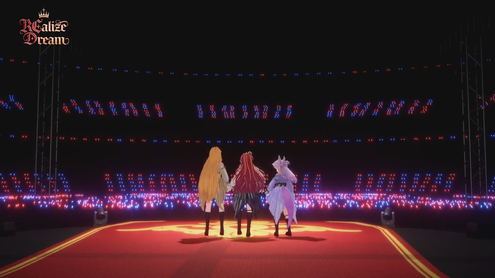</a>
---
#### <a href="https://vod.sooplive.co.kr/player/190358849" target="_blank">비몽 단독 콘서트 "Be Daydreamer"✨</a>
<a href="https://vod.sooplive.co.kr/player/190358849" target="_blank">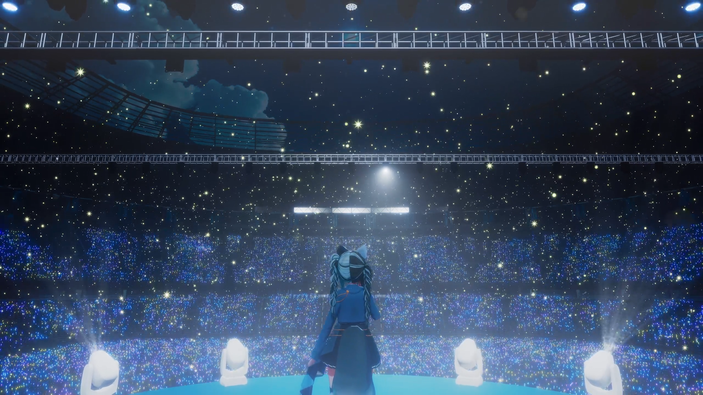</a>
---
#### <a href="https://vod.sooplive.co.kr/player/177340737" target="_blank">도파민 3주년 콘서트〚PANORAMA〛</a>
<a href="https://vod.sooplive.co.kr/player/177340737" target="_blank">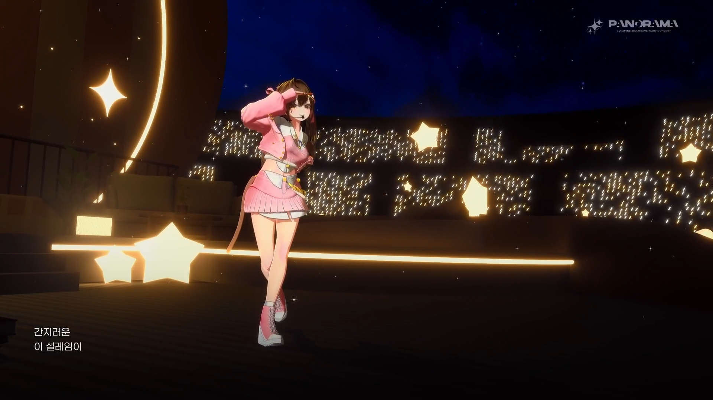</a>
---
#### <a href="https://vod.sooplive.co.kr/player/168209731" target="_blank">쿠우 첫 번째 온라인 콘서트 REMEMBER</a>

---
#### <a href="https://youtu.be/xuDAw0M-xQ0?si=Ov486JQbZGCLUfVD" target="_blank">SPYAIR - 사무라이하트(Some Like It Hot!!) | Cover by 제갈금자x모구구</a> - Custom Edit

---
#### <a href="https://vod.sooplive.co.kr/player/167068401" target="_blank">블리즈 1st concert [PANDORA]</a>
<a href="https://vod.sooplive.co.kr/player/177340737" target="_blank">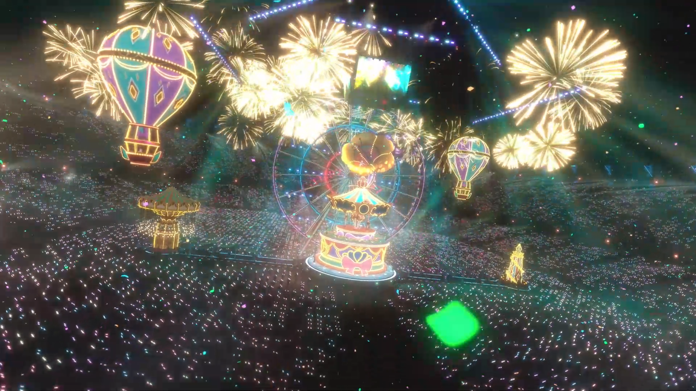</a>
---
#### <a href="https://youtu.be/bn9Kg9j9E_M?si=mYpym0DJne38EZWA" target="_blank">비몽(BEEMONG) - Fly High Official MV</a>
<a href="https://vod.sooplive.co.kr/player/177340737" target="_blank">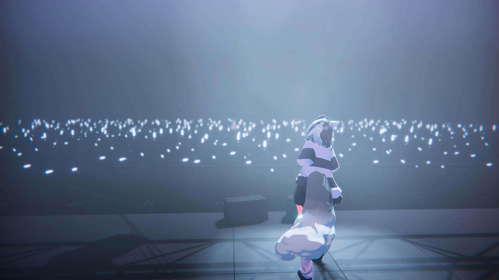</a>
---
#### <a href="https://youtu.be/MCWcvp6PEow?si=o83Go6oifiNhs_ah" target="_blank">W/X/Y - Tani Yuuki｜Cover by 여르미 x 한결 x 비몽</a>

---
#### <a href="https://youtu.be/Ef-MRWAuxl4?si=bBGenQ0w0svksLmz" target="_blank">(여자)아이들((G)I-DLE) - LION Covered by 고여름 이주인 쿠우 한세긴 | 청백가요대전</a>
<a href="https://vod.sooplive.co.kr/player/177340737" target="_blank">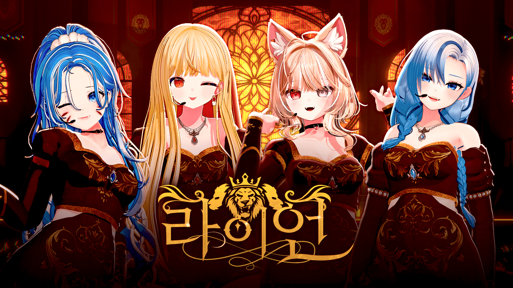</a>
---
#### <a href="https://youtu.be/7xNsG3OMwiY?si=k39dgHVmXUNLP_K8" target="_blank">[청백가요대전] Miiro-「괴물이 피는 숲」 Cover by.비몽 feat.핑맨</a>
<a href="https://vod.sooplive.co.kr/player/177340737" target="_blank">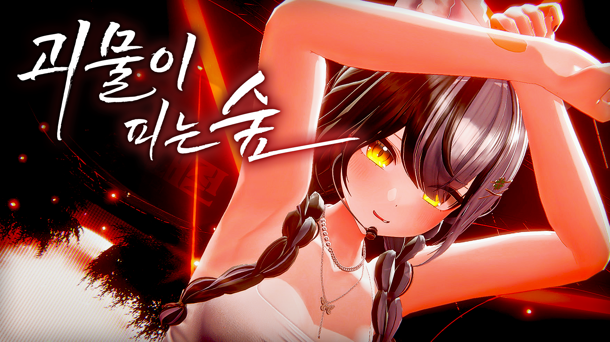</a>
---
#### <a href="https://youtu.be/i3ftfMXvquk?si=yS7oZUIkEGxMgng4" target="_blank">REMEMBER - 버튜버 청백가요대전 20명 단체곡</a>
<a href="https://vod.sooplive.co.kr/player/177340737" target="_blank">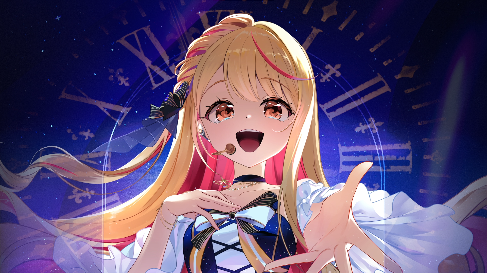</a>
---
#### <a href="https://youtu.be/Xdd3J8EFy6I?si=B5_PMD4owXeZkGRm" target="_blank">[청백가요대전] SUPERPOWER - 나비&u32 (Cover) 4K</a>

---
#### <a href="https://youtu.be/2KKjqsUAZW0?si=QwP5EsCzg6oAbkJw" target="_blank">【버츄페】 청춘펀치 - 권민&김치만두｜Covered By 미르</a>
<a href="https://vod.sooplive.co.kr/player/177340737" target="_blank">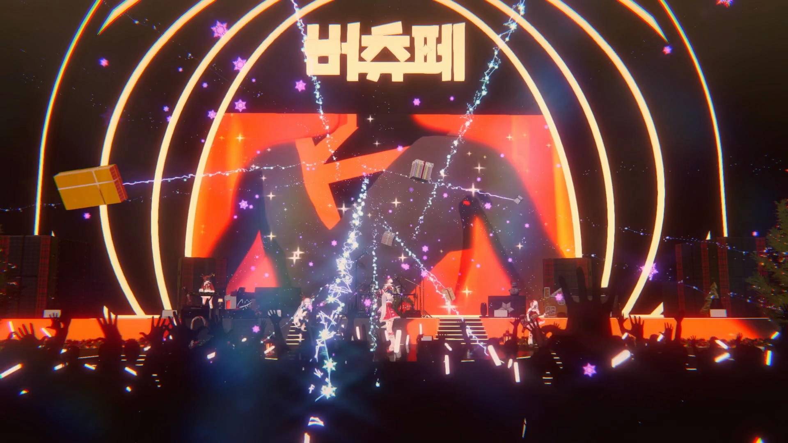</a>
---
